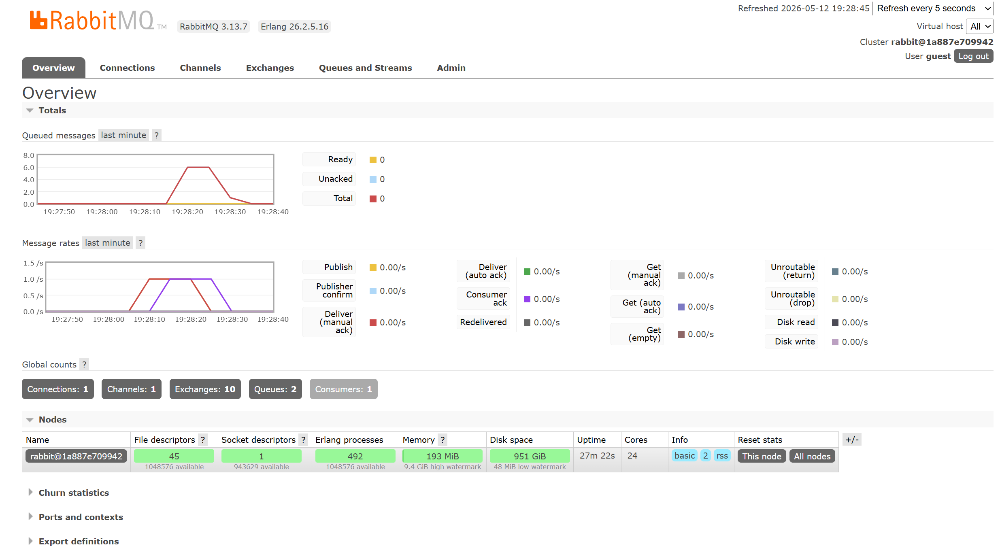

# Modul 9 - Subscriber

1. AMQP (Advanced Message Queuing Protocol) adalah standar protokol application layer yang terbuka untuk message-oriented middleware. Protokol ini memungkinkan terjadinya pengiriman pesan secara aman, andal, dan interoperabel antar sistem atau aplikasi yang berbeda (seperti publisher dan subscriber).

2. URL tersebut adalah format koneksi ke message broker (RabbitMQ).
guest yang pertama adalah username default RabbitMQ.
guest yang kedua adalah password default RabbitMQ.
localhost:5672 menunjukkan bahwa message broker sedang berjalan di mesin lokal (komputer ini) dan mendengarkan permintaan koneksi pada port 5672.

Pada mesin saya, antrean (queue) melonjak hingga mencapai angka 6. Hal ini terjadi karena setiap kali saya menjalankan publisher, program tersebut secara instan mengirimkan 5 buah event ke dalam antrean. Karena saya menjalankannya beberapa kali dengan cepat, broker menerima tumpukan pesan dalam satu waktu. Namun, karena subscriber sengaja diperlambat dengan waktu tunda (delay) selama 1 detik untuk setiap pesannya, subscriber tidak dapat mengimbangi laju masuknya pesan yang sangat cepat tersebut. Akibatnya, pesan-pesan yang belum diproses akhirnya menumpuk sementara di dalam antrean RabbitMQ.