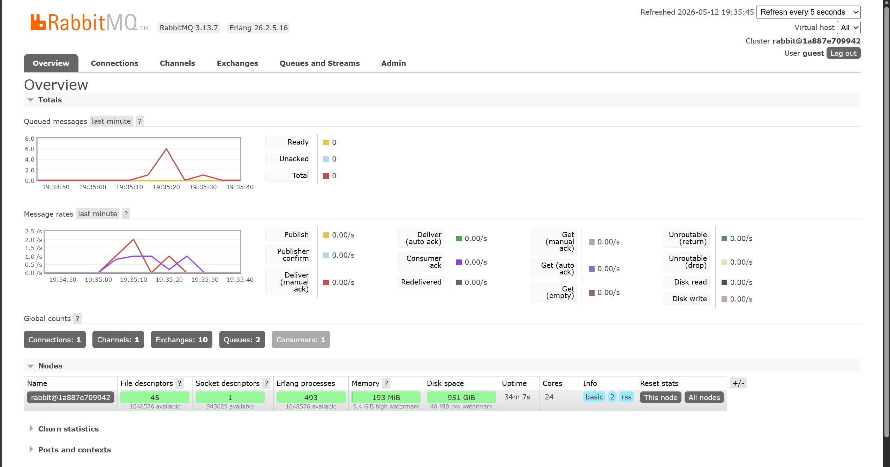

# Modul 9 - Subscriber

1. AMQP (Advanced Message Queuing Protocol) adalah standar protokol application layer yang terbuka untuk message-oriented middleware. Protokol ini memungkinkan terjadinya pengiriman pesan secara aman, andal, dan interoperabel antar sistem atau aplikasi yang berbeda (seperti publisher dan subscriber).

2. URL tersebut adalah format koneksi ke message broker (RabbitMQ).
guest yang pertama adalah username default RabbitMQ.
guest yang kedua adalah password default RabbitMQ.
localhost:5672 menunjukkan bahwa message broker sedang berjalan di mesin lokal (komputer ini) dan mendengarkan permintaan koneksi pada port 5672.

Pada mesin saya, queue melonjak hingga mencapai angka 6. Hal ini terjadi karena ketika saya menjalankan publisher, program tersebut secara instan menembakkan banyak pesan (5 event per eksekusi) ke dalam antrean message broker. Karena subscriber yang berjalan hanya ada satu dan sengaja diperlambat dengan delay selama 1 detik untuk setiap pesannya, subscriber tunggal ini tidak sanggup memproses laju masuknya pesan secara instan. Akibatnya, pesan-pesan yang belum diproses terpaksa mengantre dan menumpuk sementara di dalam RabbitMQ (terlihat dari grafik yang menanjak), sebelum akhirnya perlahan-lahan diproses satu per satu hingga antreannya habis.

Ketika saya menjalankan tiga subscriber secara bersamaan, puncak antrean pesan (spike) pada RabbitMQ menurun jauh lebih cepat dibandingkan saat hanya menggunakan satu subscriber. Hal ini terjadi karena ketiga subscriber tersebut bekerja secara paralel dan bertindak sebagai worker pool yang saling membagi beban kerja. Meskipun setiap program subscriber masih memiliki simulasi delay yang lambat yaitu 1 detik per pesan, pemrosesan secara paralel memungkinkan sistem untuk menyelesaikan 3 pesan sekaligus di waktu yang bersamaan. Hasilnya, antrean pesan instan yang dikirim oleh publisher tidak sempat menumpuk terlalu lama dan dapat ditangani dengan jauh lebih efisien.